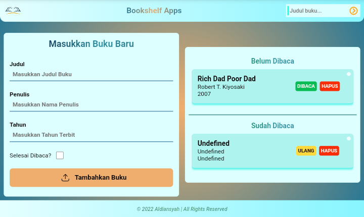

# Bookshelf-Apps
Submission Dicoding Course - Belajar Membuat Front End Web Sederhana

# Fitur Tersedia

- Menambahkan Data Buku
- Memindahkan Data Buku antar Rak
- Mencari Data Buku
- Menghapus Data Buku
- Responsive and with toggle Search Bar using vanilla javascript.
